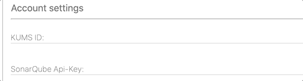

# svelte-labeled-input
- Web-component: `<labeled-input></labeled-input>`
- or Svelte-component: `import LabeledInput from 'svelte-labeled-input'`

css3 layout label transition input text field



[Try out live example:](https://ivosdc.github.io/svelte-labeled-input/ "GeneralCrudTable Example")

[](https://www.webcomponents.org/element/svelte-labeled-input)

## Install

```
npm install svelte-labeled-input
```

[](https://www.paypal.com/cgi-bin/webscr?cmd=_s-xclick&hosted_button_id=7V5M288MUT7GE&source=url)


# Usage
Import the component.
```
    import LabeledInput from 'svelte-labeled-input'
```

Use the component.
```
    <LabeledInput name="prename"
                  placeholder="Your prename"
                  label="Prename:"
                  bind:value={prename}/>
```

The styled and labeled input "html"-element offers the parameter:
```
    export let name;        // Name of the component in DOM
    export let placeholder; // Placeholder for no input value
    export let value;       // Value of the input field. 
    export let label;       // Label of the input field
```

### Web-Component
```
<custom-element-demo>
<template>
<head>
    <meta charset='utf-8'>
    <meta name='viewport' content='width=device-width,initial-scale=1'>
    <title>Generic Crud Table</title>
    <link rel='icon' type='image/png' href='favicon.png'>
    <link rel='stylesheet' href='https://ivosdc.github.io/svelte-labeled-input/build/labeled-input.css'>
    <script defer src='https://ivosdc.github.io/svelte-labeled-input/build/labeled-input.js'></script>
</head>

<body>
<hr>
<labeled-input name="prename"
               placeholder="Your prename"
               label="Prename:"
               value=""></labeled-input>
<labeled-input name="fullname"
               placeholder="Your family name"
               label="Name:"
               value=""></labeled-input><hr>
</body>
</template>
</custom-element-demo>
```

```html
<labeled-input></labeled-input>
```


###  Svelte-Component:
```
<script>
    import LabeledInput from 'svelte-labeled-input'

    let prename;
    let fullname;
</script>

<main>
    <hr>
    <LabeledInput name="prename"
                  placeholder="Your prename"
                  label="Prename:"
                  bind:value={prename}/>
    <LabeledInput name="fullname"
                  placeholder="Your name"
                  label="Family name:"
                  bind:value={fullname}/>
</main>

```
